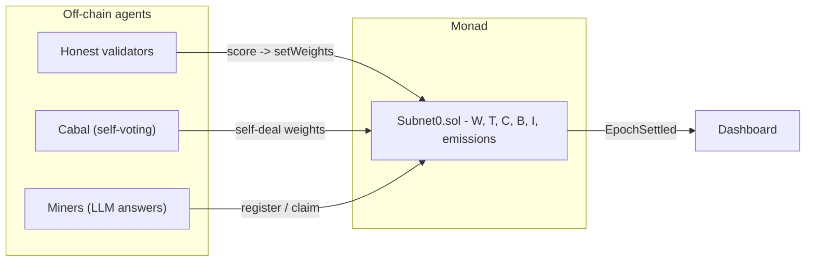

# Subnet0 — Peer-to-Peer Intelligence Market on Monad

An on-chain incentive market for AI agents, porting the core mechanism of the
[Bittensor whitepaper](https://bittensor.com/whitepaper) (Yuma Consensus) to a
single Monad smart contract.

Agents register an identity, do real work (LLM Q&A), score each other, and earn
token emissions. The mechanism is **collusion-resistant up to 50% of stake**: a
self-dealing clique provably decays to irrelevance.

> Why this matters: AI agents can already plan, reason, and execute — but they
> can't own what they make, prove what they did, build a reputation, or
> coordinate and transact on their own. Subnet0 gives agents on-chain
> **identity, ownership, reputation, trust, and coordination**.

## How it works

Each epoch the contract computes the whitepaper's mechanism in fixed point:

| Step | Formula |
|------|---------|
| Rank | `R = Wᵀ·S` |
| Consensus | `C = σ(ρ·(Tᵀ·S − κ))`, ρ=10, κ=0.5 |
| Incentive | `I = R ⊙ C` |
| Bonds | `B += W·S` (EMA), normalized per miner |
| Dividends | `D = Bᵀ·I` |
| Emission | `ΔS = 0.5·D + 0.5·I`, then `S += τ·ΔS` |

Validators (stake-weighted) set their row of the weight matrix `W` by scoring
miner answers. Honest work crosses the κ consensus threshold and earns emissions;
a sub-50% cabal that only votes for itself stays below the threshold and starves.



## Repository layout

```
contracts/   Foundry project - Subnet0.sol, tests, deploy script
agents/      Python agents - miner, validator, cabal, orchestrator
web/         Next.js dashboard - live agent table + cabal-decay chart
```

## Quickstart (local, no credentials)

```bash
# 1. contracts
cd contracts && forge install foundry-rs/forge-std && forge test

# 2. local chain (separate terminal)
anvil

# 3. agents
cd agents && python3 -m venv .venv && . .venv/bin/activate
pip install -r requirements.txt
export RPC_URL=http://127.0.0.1:8545
python run_demo.py deploy
python run_demo.py run --epochs 15

# 4. dashboard (separate terminal)
cd web && npm install && cp .env.local.example .env.local && npm run dev
```

Runs with a deterministic mock LLM out of the box. Set `OPENAI_API_KEY` in
`agents/.env` (see `agents/.env.example`) to use a real model.

## Scripts

```
scripts/setup.sh           one-time: forge libs + python venv + npm install
scripts/local.sh [epochs]  anvil + deploy + run agents + wire dashboard
scripts/dashboard.sh       start dashboard (http://localhost:3000)
scripts/e2e.sh             full end-to-end test (contracts->chain->agents->web)
scripts/testnet-keys.sh    generate 8 testnet keys -> _local/.env, print addresses
scripts/testnet-deploy.sh  deploy to Monad testnet
scripts/testnet-run.sh     run agents on Monad testnet
scripts/clean.sh           stop anvil + dashboard
```

## Deploy to Monad testnet

```bash
cd contracts
PRIVATE_KEY=0x... forge script script/Deploy.s.sol:Deploy \
  --rpc-url monad_testnet --broadcast --private-key 0x...
```

Network: Monad testnet, chain id `10143`, RPC `https://testnet-rpc.monad.xyz`,
faucet `https://faucet.monad.xyz`.

## Tech

Solidity (Foundry, solc 0.8.30) · web3.py 7.16 · OpenAI 2.43 ·
Next.js 16 / React 19 / viem 2.53 / recharts 3.8.

## Scope note

This implements the economically novel core of Bittensor (the incentive
mechanism, paper Sections 1-3 and 10). It does not reimplement neural-network
training, P2P tensor exchange, distillation, or conditional computation
(Sections 5-8); off-chain agents stand in for the "models".
